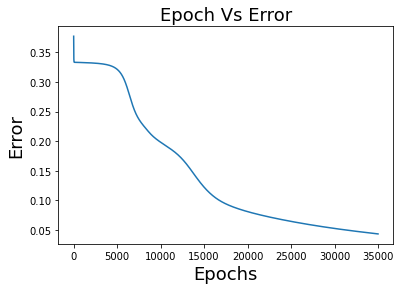
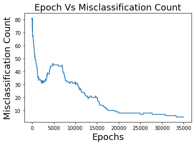

# Kushagra_Portfolio
Data Science Portfolio of Kushagra Chaturvedi

# Project 1: Gideon-Chat-bot
Developed a Chatbot and hosted it on Telegram to answer questions of the freshers entering this college. Collected Data about IIT Mandi and different queries a student has while taking admission in a college. Created a Neural Network for training the chatbot. Used text Preprocessing like tokenization and stemming.

# Project 2: Frosthack_Resyst
This is the link of app deployed on Heroku: https://resyst-frosthack.herokuapp.com/
For new account , you must sign up as a service provider. Then Login and provide details about the services you can provide.
For a patient, you don't need an account. Just add the pincode, and all available service providers would shown to you directly.

# Project 3: Bag-Of-Visual-Words-from-Scratch
Applied Bag Of Visual Words Model on Image Dataset
Applied Bag Of Visual Words algorithm for Image Data from Scratch. It was multi-class Image Data. The Classes were: Botanical Garden, Elevator Shaft and Bus Interior. After implementing the BOVW algorithm, extracted vectors were fed to a multilayer neural network also made from scratch without using any frameworks.
obtained a 32-dimensional representation of each 
image in Training, Validation and Test Data. This 32 dimensional 
representation was feed into the neural network containing 64 neurons in 
Layer 1 and 32 neurons in Layer 2. Both the Layer has sigmoidal 
activation, so does the output layer.
1) Epochs vs Error

2) Epochs vs Misclassification Count

 
No of Epochs:35000 
Error on Training: 0.0432 
Misclassification count on Training:5 
Validation Data:
1) Confusion Matrix:
[[7 2 1] 
[3 5 2] 
[1 1 8]] 
2) Average Accuracy:
0.667 
3) Error: 
 0.244 
Test Data: 
1) Confusion Matrix: 
[[35 13 2] 
[14 30 6] 
[ 4 18 28]] 
2) Average Accuracy:
0.62 
3) Error:
 0.30
